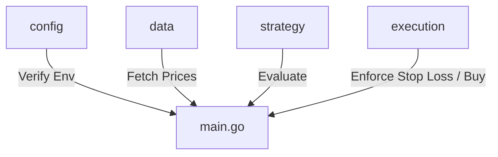

# Go Trading Bot

A Go-based automated trading bot that integrates with the **Alpaca Trade API** (v3) to fetch market data, evaluate trading strategies using technical indicators, and execute trades with risk management rules.

---

## Architecture Overview

The codebase is modularly designed into separate packages representing distinct layers of a trading system:



### 1. Configuration (`config`)
* [config/config.go](file:///C:/Users/johan/Desktop/weekend-projects/go-tradingbot/config/config.go): Verifies that Alpaca API credentials (`APCA_API_KEY_ID`, `APCA_API_SECRET_KEY`) are present in the environment or `.env` file.

### 2. Market Data (`data`)
* [data/fetcher.go](file:///C:/Users/johan/Desktop/weekend-projects/go-tradingbot/data/fetcher.go): Connects to Alpaca's historical market data endpoints to retrieve hourly closing prices for a given ticker symbol.

### 3. Trading Strategy (`strategy`)
* [strategy/sma.go](file:///C:/Users/johan/Desktop/weekend-projects/go-tradingbot/strategy/sma.go): Calculates the Simple Moving Average (SMA) technical indicator.
* [strategy/rsi.go](file:///C:/Users/johan/Desktop/weekend-projects/go-tradingbot/strategy/rsi.go): Computes the Relative Strength Index (RSI) using Wilder's smoothing technique.
* [strategy/logic.go](file:///C:/Users/johan/Desktop/weekend-projects/go-tradingbot/strategy/logic.go): Formulates the `BUY` or `HOLD` trade signal:
  * **Buy Condition**: Current price is greater than the SMA-50 (upward trend indicator) **AND** RSI-14 is below 30 (oversold momentum indicator).
* [strategy/strategy_test.go](file:///C:/Users/johan/Desktop/weekend-projects/go-tradingbot/strategy/strategy_test.go): Comprehensive unit test suite covering RSI calculation, SMA calculation, and the buy/hold evaluation logic.

### 4. Trade Execution & Risk Management (`execution`)
* [execution/riskmanagement.go](file:///C:/Users/johan/Desktop/weekend-projects/go-tradingbot/execution/riskmanagement.go): Contains the `RiskGuard` mechanism which enforces:
  * **Stop Loss**: Periodically monitors positions and liquidates any asset if its unrealized loss exceeds 1.5% of total account equity.
  * **Fractional Share Execution**: Submits market buy orders by defining a dollar budget (2% of total equity) using Alpaca's fractional share capability.

---

## Setup and Installation

### Prerequisites
* Go 1.18 or higher installed.
* Alpaca API key and secret key (paper or live trading account).

### Environment Configuration
Create a `.env` file in the root directory:

```env
APCA_API_KEY_ID=your_alpaca_key_id
APCA_API_SECRET_KEY=your_alpaca_secret_key
APCA_API_BASE_URL=https://paper-api.alpaca.markets # Or live URL
```

### Run Tests
To run package tests and ensure everything is configured properly:
```bash
go test -v ./...
```
