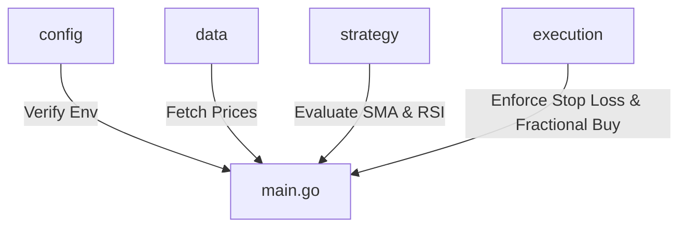
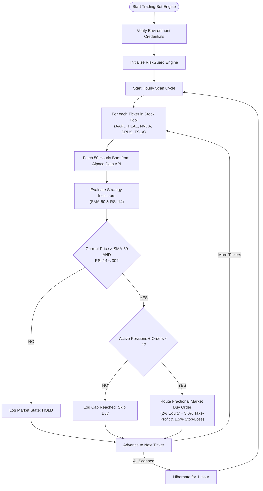

# Go Trading Bot

A Go-based automated trading bot that integrates with the **Alpaca Trade API** (v3) to fetch market data, evaluate trading strategies using technical indicators, and execute trades with risk management rules.

---

## Architecture Overview

The codebase is modularly designed into separate packages representing distinct layers of a trading system:



### 1. Configuration (`config`)
* [config/config.go](file:///C:/Users/johan/Desktop/weekend-projects/go-tradingbot/config/config.go): Verifies that Alpaca API credentials (`APCA_API_KEY_ID`, `APCA_API_SECRET_KEY`) are loaded via `.env` or system environment variables (`config.VerifyEnvironment()`).

### 2. Market Data (`data`)
* [data/fetcher.go](file:///C:/Users/johan/Desktop/weekend-projects/go-tradingbot/data/fetcher.go): Connects to Alpaca's historical market data API (`marketdata.GetBars`) to retrieve hourly closing prices for target stock symbols (`data.FetchClosingPrices()`).

### 3. Trading Strategy (`strategy`)
* [strategy/sma.go](file:///C:/Users/johan/Desktop/weekend-projects/go-tradingbot/strategy/sma.go): Calculates the Simple Moving Average (SMA) technical indicator (`strategy.CalculateSMA()`).
* [strategy/rsi.go](file:///C:/Users/johan/Desktop/weekend-projects/go-tradingbot/strategy/rsi.go): Computes the Relative Strength Index (RSI) using Wilder's smoothing technique (`strategy.CalculateRSI()`).
* [strategy/logic.go](file:///C:/Users/johan/Desktop/weekend-projects/go-tradingbot/strategy/logic.go): Formulates the trade evaluation logic (`strategy.EvaluateStrategy()`):
  * **Buy Condition (`BUY`)**: Current price > SMA-50 (upward trend indicator) **AND** RSI-14 < 30 (oversold momentum indicator).
  * **Hold Condition (`HOLD`)**: Default state when buy conditions are not met.

### 4. Trade Execution & Risk Management (`execution`)
* [execution/riskmanagement.go](file:///C:/Users/johan/Desktop/weekend-projects/go-tradingbot/execution/riskmanagement.go): `RiskGuard` engine for trade routing and risk controls:
  * **Attached Bracket Orders**: Submits orders with attached **3.0% Take-Profit** (`alpaca.TakeProfit`) and **1.5% Stop-Loss** (`alpaca.StopLoss`) directly on order creation (2:1 risk/reward ratio), delegating exit execution directly to Alpaca.
  * **Position & Order Cap**: Limits portfolio risk by capping total active positions + pending open orders to a maximum of 4 from the stock pool.
  * **Fractional Share Allocation**: Allocates 2% of total account equity per trade, checking available buying power and preventing duplicate positions.

### 5. Bot Engine & Orchestration (`main.go`)
* [main.go](file:///C:/Users/johan/Desktop/weekend-projects/go-tradingbot/main.go): Orchestrates the live trading bot workflow:
  * Configures timestamped logging (`log.Lmicroseconds`).
  * Initializes the `RiskGuard` engine.
  * Defines the stock pool (`stockPool`: `AAPL`, `HLAL`, `NVDA`, `SPUS`, `TSLA`).
  * Runs a continuous hourly loop:
    1. **Market Scan**: Fetches 50-period hourly prices for target tickers in `stockPool`.
    2. **Signal Evaluation**: Evaluates SMA-50 and RSI-14 triggers.
    3. **Order Routing**: Executes fractional buy orders with attached bracket Take-Profit and Stop-Loss orders when `BUY` signals trigger (up to 4 active open positions/orders).
    4. Hibernates for 1 hour between scan cycles.

---

## Trading Engine Execution Loop



---

## Setup and Installation

### Prerequisites
* Go 1.18 or higher installed.
* Alpaca API key and secret key (paper or live trading account).

### Environment Configuration
Create a `.env` file in the root directory:

```env
APCA_API_KEY_ID=your_alpaca_key_id
APCA_API_SECRET_KEY=your_alpaca_secret_key
APCA_API_BASE_URL=https://paper-api.alpaca.markets # Or live URL
```

### Running the Bot
To run the automated trading engine:
```bash
go run main.go
```


